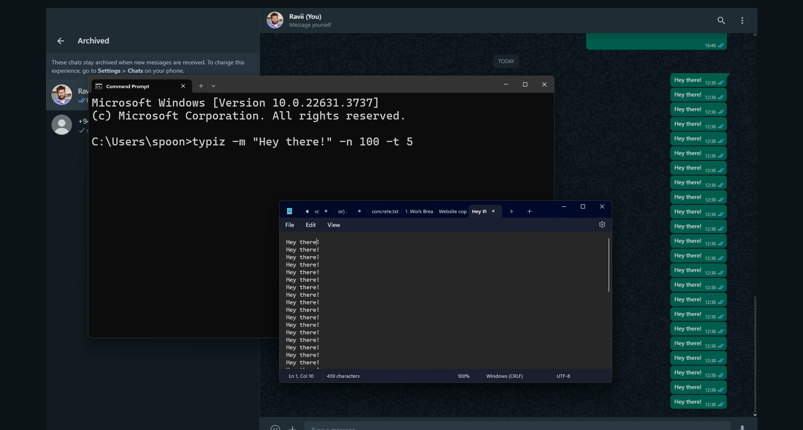

# Typiz

Typiz is a Python-based auto typing tool designed to help you automate repetitive typing tasks. Whether you need to write the same phrases repeatedly, Typiz can save you time and effort by typing for you accurately and efficiently. Simply configure your typing needs, and let Typiz handle the rest!

[Install for windows](https://github.com/mounter7/typiz/releases/download/typiz-1.0v/typiz.zip)
[Install for linux or Mac OS](https://github.com/mounter7/typiz/archive/refs/heads/main.zip)

## Steps
1. Open the terminal

2. Install packages
```
pip install -r requirements.txt
```
3. Check the version
```
typiz -v
```
4. Just type
```
typiz -m <message> -n <number of times> -t <delay time>
```
- m: Message (The message you want to type)
- n: Number of times (How many times you want to type the message)
- t: Delay time (The amount of time you want to set up your mouse cursor)

for example:
```
typiz -m "Hey guys!" -n 100 -t 5
```

Screenshot


Created by Ravindu Madhushankha
